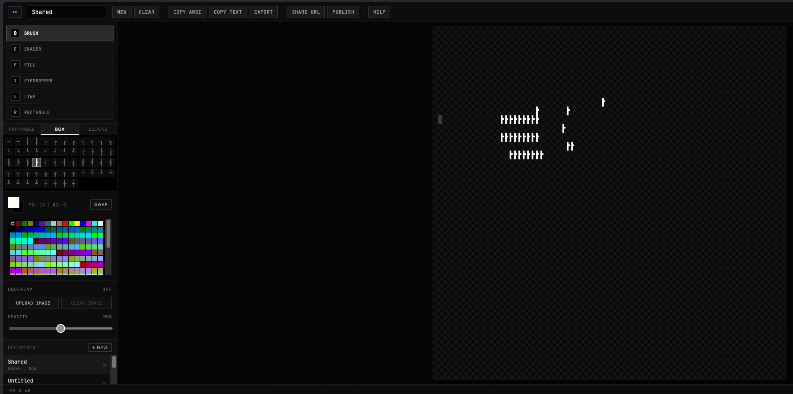

# unit32-ascii

A fast, offline-first ASCII / ANSI art editor. Each grid cell is packed into a
single `Uint32` (16 bits character, 8 bits foreground, 8 bits background) and
rendered through a glyph atlas with dirty-cell blitting.



## Features

- **Six tools**: brush, eraser, paint bucket fill, eyedropper, line, rectangle
- **256-colour xterm palette** with foreground / background selection and swap
- **Transparent cell backgrounds** using background index `0`, with a checkerboard
  canvas backdrop for visibility
- **Reference image underlay**: upload a local PNG or JPEG behind the canvas and
  adjust opacity while tracing
- **Box-drawing and block characters** plus full printable ASCII
- **Bresenham line interpolation** so brush strokes don't skip pixels
- **Offline-first**: multiple named documents persisted to IndexedDB with
  debounced autosave
- **Shareable URLs**: compressed grid state encoded into a `#fragment`; no
  account or server required
- **Optional gallery backend** (Go) for publishing artworks behind a stable URL
- **Web Worker ANSI export**, copy to clipboard, or download as `.ans`
- **Pointer events** (mouse, pen, touch), right-click erase, and keyboard
  shortcuts
- **In-app confirmation dialogs** for destructive actions and publishing prompts

## Keyboard shortcuts

| Key | Action |
| --- | --- |
| `B / E / F` | Brush / Eraser / Fill |
| `I / L / R` | Eyedropper / Line / Rectangle |
| `X` | Swap foreground and background |
| Any printable | Set that character as the brush |
| Right-click drag | Erase without changing the selected tool |
| `Ctrl/Cmd+Z` | Undo |
| `Ctrl/Cmd+Shift+Z` | Redo |
| `Ctrl/Cmd+N` | New document |
| `?` | Toggle help |

## Underlay workflow

Use the **Underlay** panel in the left sidebar to upload a local PNG or JPEG as
a tracing reference. The image is shown behind the transparent ASCII canvas and
does not get saved into the artwork, exported ANSI, share URL, or gallery
payload. Clear the image when you are done, or adjust opacity to keep the grid
legible while drawing.

## Frontend

Requires Node 20+.

```bash
npm install
npm run dev      # start dev server
npm run build    # production build to dist/
```

Optionally point the frontend at a custom backend by setting
`VITE_API_URL=https://your-host` before `npm run build` (or in `.env.local`).

## Backend (Go)

The backend is a small `chi`-based service that stores artwork bytes on the
local filesystem (`./data/<id>.bin`) and metadata in a sidecar JSON file
(`./data/<id>.json`). It is intentionally dependency-light; swap the storage
layer for S3 / Postgres without changing the HTTP surface.

```bash
cd backend
go build -o server .
./server
```

Environment variables:

- `ADDR` (default `:8080`)
- `CORS_ORIGINS` comma-separated list, or `*` (default `*`)

Endpoints:

- `GET  /healthz` health probe
- `GET  /artworks` list the 100 most recent artworks
- `GET  /artworks/{id}` fetch one artwork (metadata + base64 cell bytes)
- `POST /artworks` publish (`{title, author, width, height, data: base64}`)

Per-IP rate limit: 60 requests / minute. Request body cap: 2 MB. Grid dims are
validated and `data.length` must equal `width * height * 4`.

## Project layout

```
src/
  engine/        memory, renderer, sprites, tools, share, storage, api client
  components/    React UI (toolbar, palette, color picker, underlay, doc panel)
  workers/       ANSI exporter Web Worker
backend/         Go HTTP service
```

## License

MIT
